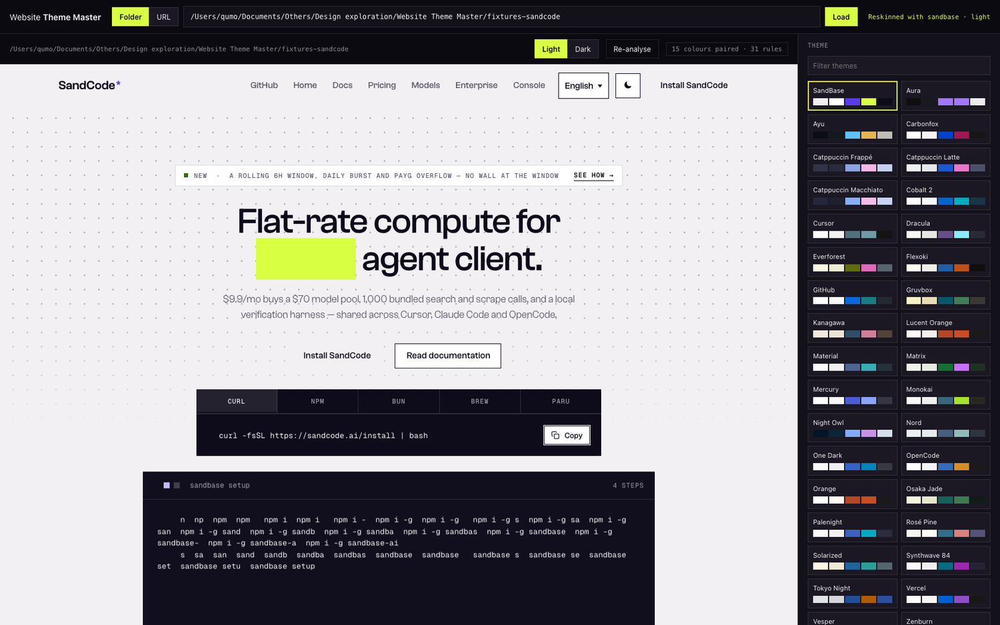
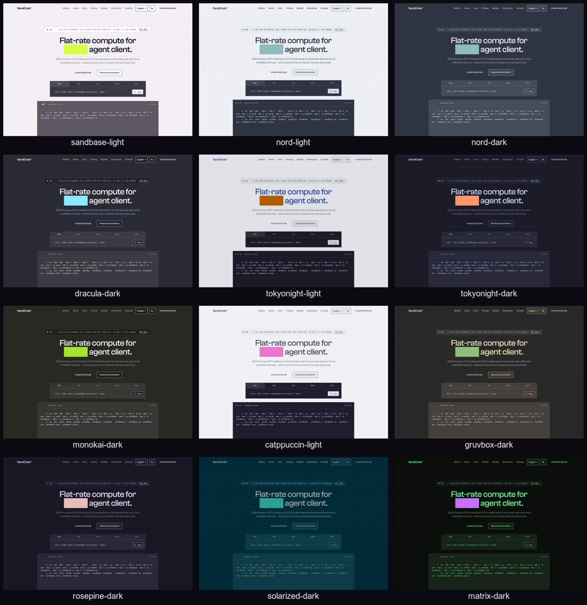
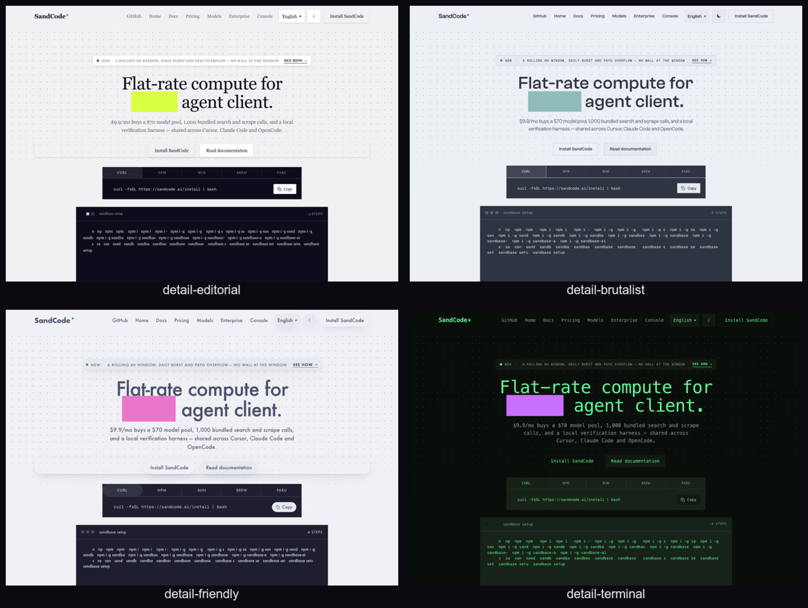
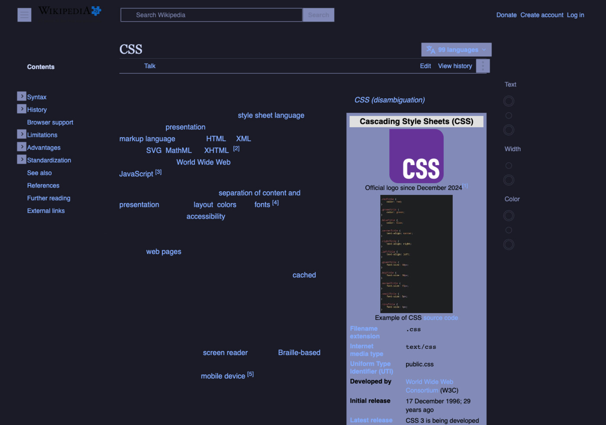

# Website Theme Master

**Point it at a website, give it a theme.** Colour, type, shape and motion — restyled live, no changes to the site's source.

Works on a local folder *or* a live URL, and needs no design tokens, no build step and no cooperation from the target site.



## Why this exists

Colour tools usually assume the site has a design system — a set of named tokens you can override. Most sites don't, and the ones that do name everything differently.

So this one measures instead of asking. It reconstructs a site's palette from what the page actually paints, then stretches that onto a theme's role ramp. A site's own light/dark structure survives; its palette doesn't.

## Quick start

```bash
npm install
npm start            # → http://127.0.0.1:4180/
```

The workbench opens with a bundled SandCode demo site already loaded. To point it somewhere else:

- **Folder** — an absolute path to a site's root directory
- **URL** — any `https://` address; the server proxies it, rewrites its asset URLs and injects the engine

## What you can control

**Colour** — 34 themes, each in light and dark, plus an **intensity** dial. At 0% the site keeps its own palette, which is the fastest way to see what the engine is actually doing.

**Everything else** — this is what separates it from a recolour tool:

| Control | Range |
| --- | --- |
| Body font / Headings | 6 stacks (System, Grotesk, Humanist, Geometric, Serif, Mono); headings can follow the body or differ |
| Corner radius | 0–24px, applied separately to buttons, fields and cards |
| Elevation | keep / flat / subtle / soft / dramatic |
| Borders | keep / soften to the theme's edge colour / remove |
| Type scale | root size, 90–120% |
| Line height | body copy |
| Heading tracking | −0.03em to +0.02em |
| Transitions | keep / calm / off |

**Export** — the finished override stylesheet, or the config as JSON.

## Screenshots

Twelve themes on the same site, all real renders:



Same site, same theme family, four different *directions* — proof that the non-colour controls do the heavy lifting:



## How the engine works

### 1. Analyse, in the page

- Walks the DOM and records painted background, text and border colours, **weighted by area**
- Reads every stylesheet it is allowed to read, keeping each colour declaration together with its selector — that pairing is the hook everything else hangs from
- Collects CSS custom properties and resolves their real values against matching elements
- Classifies elements into roles: real buttons, real fields, real cards, elements that actually carry a shadow. The detail controls aim at these instead of guessing from class names.

### 2. Map colours onto roles

Each measured colour is placed by its **distance from the page canvas**, then paired with the theme's ramp:

- Neutrals are resolved along **three separate tracks** — background, foreground, border. This is the crux: SandCode paints `#0e0b1a` as its body ink *and* as its terminal panel, and `#f2f0f3` as the page canvas *and* as the ink inside that panel. One global mapping will always get one of those wrong.
- **Inverse panels** — the dark terminal on a light page, the light card on a dark one — are detected and pinned to the theme's `plate`, instead of being resolved as body copy and flipped inside out.
- Chromatic colours are paired by hue; the loudest colour on the site becomes the theme's accent.
- Well-named custom properties get their role from the name (`--muted` is the muted text because it says so). Names beat statistics, and measurement beats names only when there is no name to go on.

### 3. Emit the override

- Every colour declaration is rewritten and emitted with `!important` — the only way to win without knowing a site's cascade
- Custom properties are overridden separately, which covers far more ground than per-declaration rewrites
- Relative `url()` and `@import` inside stylesheets are rewritten too, or proxied fonts and images 404

### The trap that shaped the design

**Analysis has to run on the page as the site wrote it, not as we painted it.** Otherwise the second theme you pick analyses the first theme's colours, and mapping them again walks the palette somewhere new every time. The engine disables its own stylesheet while measuring, forces a style recalculation, and skips its own sheet when walking stylesheets.

This is invisible in a single test. It only shows up when you switch themes repeatedly and watch the colours drift.

## Case study: SandCode

SandCode is an awkward target on purpose: a light base with dark terminal panels and dark CTA bands embedded in it, and a token set where two hex values do four jobs.

Run against the real project directory:

```bash
node tools/shoot.mjs --target "/path/to/sandcode"
```

Switching back to the SandBase theme restores the original design colour for colour:

```
light   bg=#f2f0f3  ink=#0e0b1a  muted=#5d5969  term=#0e0b1a/#f2f0f3  card=#ffffff  mark=#d9ff43
dark    bg=#0e0b1a  ink=#f2f0f3  muted=#a29ea9  term=#1e1936/#f2f0f3  card=#241d44  mark=#8b6fff
```

And the palette survives theme-switching without drifting — switch through a dozen themes and come back, and every value is identical.

The four detail directions above, measured on the same site:

| Direction | Radius | Font | Also | Measured |
| --- | --- | --- | --- | --- |
| editorial | 3px | Serif | soft shadow, line-height 1.65 | button 4px · Georgia · `0 2px 6px` · 28.05px |
| brutalist | 2px | keep original | no shadow, tracking +0.02em, motion off | button 3px · Clash Grotesk · no shadow · +1.2px |
| friendly | 18px | Geometric | soft shadow, type scale 110% | button 25px · Century Gothic · root 17.6px |
| terminal | 2px | Mono | no shadow, softened borders | button 3px · ui-monospace · no shadow |

```bash
npm run verify    # asserts every value above, then confirms a full reset
```

## Live sites

```
https://example.com                 →    3 colours paired ·    3 rules
https://en.wikipedia.org/wiki/CSS   →   23 colours paired · 1341 rules
```



Wikipedia is a good stress test: its palette lives in CSS custom properties, and the search box, infobox, sidebar and tab bar each have their own surface. **A lookup table alone moved 35 rules and left a page full of white boxes**; resolving every colour it never showed us is what takes it past a thousand, and what makes those panels actually follow the theme.

## Project structure

```
Website Theme Master/
├── server.mjs              studio server + site proxy + asset rewriting + injection
├── studio/                 the workbench (no build step)
│   ├── index.html · studio.css · studio.js
│   └── inject.js           engine entry point, runs inside the themed page
├── engine/                 isomorphic — Node and the browser share one copy
│   ├── color.mjs           parsing, mixing, contrast, alpha compositing
│   ├── roles.mjs           the role vocabulary + fallback theme
│   ├── theme.mjs           theme model + OpenCode/Theme Studio import
│   ├── analyze.mjs         palette and selector extraction
│   ├── remap.mjs           role mapping + override CSS generation
│   └── details.mjs         fonts, radius, shadow, tracking, motion
├── themes/                 34 role-format themes + index.json
├── fixtures-sandcode/      bundled demo target
├── tools/
│   ├── import-themes.mjs   Theme Studio themes → role model
│   ├── smoke.mjs           end-to-end assertions
│   ├── verify-details.mjs  numeric assertions for the detail controls
│   └── shoot.mjs           preview renders (--target for any site)
├── docs/                   screenshots used here
└── out/                    generated renders
```

## Commands

```bash
npm start                          # launch the workbench
npm run smoke                      # end-to-end assertions
npm run verify                     # detail-control assertions
npm run shoot                      # render the full preview set
npm run shoot -- --target <dir>    # render against any site
npm run themes                     # re-import the theme library
```

## Verification

`npm run smoke` does not check that the page opens. It asserts the product's actual claims:

```
PASS  engine produces an override stylesheet
PASS  switching theme repaints the canvas
PASS  switching theme repaints the ink
PASS  dark mode re-derives the palette
PASS  intensity changes the result
PASS  body font control applies
PASS  heading tracking applies
PASS  type scale applies
PASS  corner radius applies
PASS  motion control applies
11/11 checks passed
```

## Known limits

- **The HTML rewrite is regex-based, not a real parser.** Fine for ordinary sites; heavy client-side rendering, strict CSP, or anything behind a login may come through incomplete.
- **Visual only — it does not touch layout.** Structure, spacing system and hierarchy stay as the site wrote them. Recomposition is a different problem with a different tool.
- **One hex, two jobs is genuinely ambiguous.** The three-track resolution handles the common cases (background vs text vs border), but a site using one colour as both its accent and its error colour has to pick.
- **The proxy forwards no cookies or auth**, so pages behind a login won't render.
- **One deliberate deviation when importing Theme Studio themes.** Its resolver checks the CSS named-colour table before its own `defs`, so Dracula's `purple` palette entry (`#bd93f9`) resolves to CSS `#800080`. This tool inverts that order — the palette the author wrote is the palette you get.
